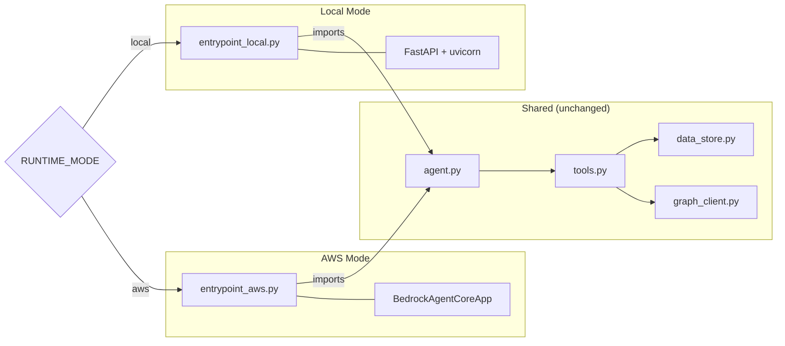
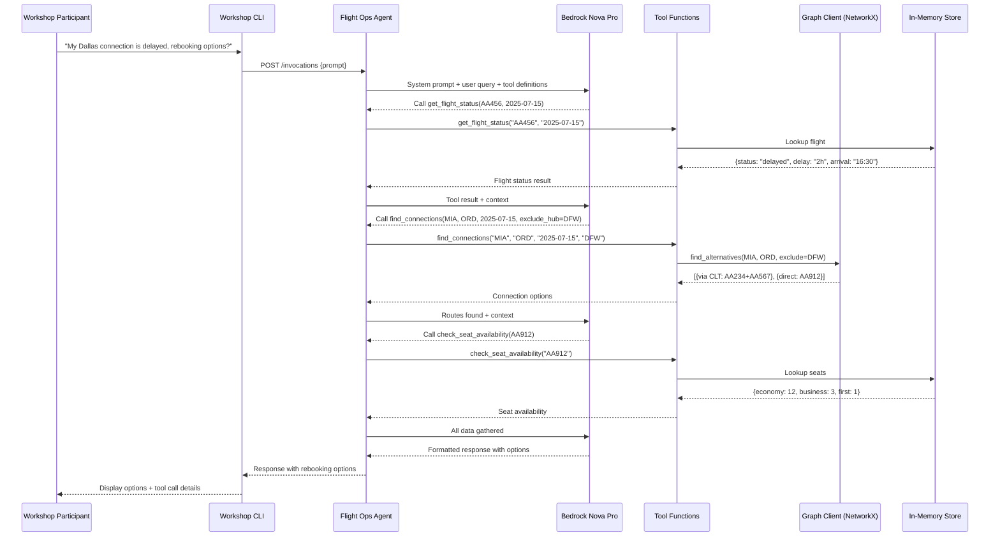
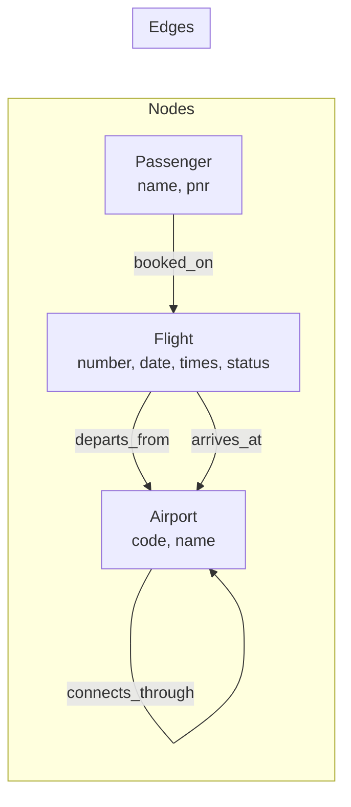
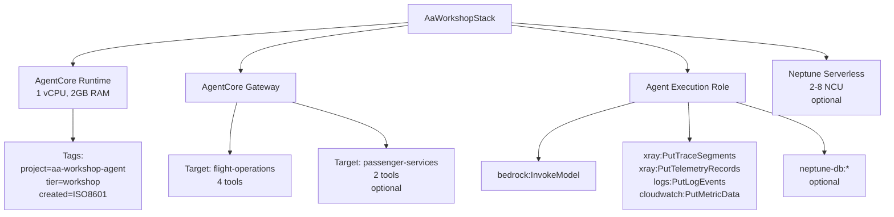

# Technical Design Document

## Overview

This document describes the technical design for the American Airlines Workshop Demo Agent — a 2–4 hour hands-on workshop where participants build, test, and deploy an AI-powered Flight Operations agent using the Strands SDK and Amazon Bedrock AgentCore.

The system follows a **dual-mode architecture** where identical agent logic runs locally (FastAPI/uvicorn) and in the cloud (AgentCore Runtime) with only the transport wrapper changing. A local knowledge graph (NetworkX) enables multi-hop reasoning for connection disruption scenarios, with an optional Neptune extension for production scale.

### Key Design Decisions

| Decision | Rationale |
|----------|-----------|
| Strands SDK for agent framework | Native AgentCore integration, simple @tool decorator, minimal boilerplate |
| NetworkX for local graph | No server process, pip-installable, sufficient for workshop-scale data |
| FastAPI for local HTTP | Matches AgentCore's /invocations + /ping contract, async-ready |
| JSON files for data | Human-editable, no database setup, loads at startup for zero-latency tool calls |
| Single agent.py with dual entrypoints | Demonstrates the core architectural pattern without conditional logic in business code |
| CDK (Python) for deployment | Single command deploy/destroy, outputs endpoint URL, tags all resources |

## Architecture

### System Architecture Diagram

```mermaid
graph TB
    subgraph "Local Development"
        CLI[Workshop CLI] -->|HTTP POST /invocations| LOCAL_EP[entrypoint_local.py<br/>FastAPI + uvicorn :8001]
        LOCAL_EP --> AGENT[agent.py<br/>Strands Agent]
        AGENT --> TOOLS[tools.py<br/>@tool functions]
        TOOLS --> DS[data_store.py<br/>In-Memory JSON]
        TOOLS --> GC_LOCAL[graph_client.py<br/>NetworkX]
        GC_LOCAL --> ROUTES[data/routes.json]
        DS --> FLIGHTS[data/flights.json]
        AGENT -->|Inference| BEDROCK[Amazon Bedrock<br/>Nova Pro]
    end

    subgraph "AWS Cloud Deployment"
        CLIENT[External Client] -->|HTTP POST /invocations| RUNTIME[AgentCore Runtime<br/>entrypoint_aws.py]
        RUNTIME --> AGENT_CLOUD[agent.py<br/>Same Code]
        AGENT_CLOUD -->|MCP Protocol| GATEWAY[AgentCore Gateway]
        GATEWAY --> FO_TARGET[flight-operations target]
        GATEWAY --> PS_TARGET[passenger-services target]
        AGENT_CLOUD -->|Inference| BEDROCK_CLOUD[Amazon Bedrock<br/>Nova Pro]
        RUNTIME -->|Auto-instrumented| OTEL[ADOT / OpenTelemetry]
        OTEL --> CW[CloudWatch<br/>GenAI Observability]
    end

    subgraph "Optional Neptune Extension"
        GC_NEPTUNE[graph_client.py<br/>NeptuneGraphClient] -->|Gremlin/openCypher| NEPTUNE[Amazon Neptune<br/>Serverless 2-8 NCU]
    end
```

### Dual-Mode Entrypoint Pattern



### Data Flow — Connection Disruption Scenario



## Components and Interfaces

### Component Overview

| Component | File | Responsibility |
|-----------|------|---------------|
| Flight Ops Agent | `src/agent.py` | Agent definition: model, system prompt, tool list |
| Custom Tools | `src/tools.py` | @tool decorated functions for flight operations |
| Graph Client | `src/graph_client.py` | Abstraction layer over NetworkX (local) / Neptune (cloud) |
| Data Store | `src/data_store.py` | JSON loader, in-memory data access |
| Local Entrypoint | `src/entrypoint_local.py` | FastAPI wrapper for local development |
| AWS Entrypoint | `src/entrypoint_aws.py` | BedrockAgentCoreApp wrapper for cloud |
| Workshop CLI | `cli.py` | Interactive terminal loop for testing |
| CDK Stack | `deployment/cdk_app.py` | Infrastructure provisioning |
| Rebooking Agent (optional) | `src/rebooking_agent.py` | Second agent for multi-agent patterns |
| Rebooking Tools (optional) | `src/rebooking_tools.py` | Passenger management tools |

### Interface Definitions

#### HTTP Contract (Local and AgentCore Runtime)

Both entrypoints expose the same HTTP interface:

```
POST /invocations
Content-Type: application/json

Request Body:
{
  "prompt": "string"  // Natural language query
}

Response Body:
{
  "response": "string"  // Agent's natural language response
}

---

GET /ping

Response Body:
{
  "status": "healthy"
}
```

#### Tool Interface

Each tool follows the Strands @tool decorator pattern:

```python
@tool
def tool_name(param1: type, param2: type) -> dict:
    """Tool description for LLM.

    Args:
        param1: Description of param1.
        param2: Description of param2.

    Returns:
        Structured result or error dict.
    """
```

**Success response pattern:**
```python
{"field1": "value", "field2": "value", ...}
```

**Error response pattern:**
```python
{"error": "error_type", "parameter": "param_name", "expected": "format description"}
# or
{"error": "not_found", "message": "Human-readable explanation"}
```

#### Graph Client Interface

```python
class GraphClientProtocol:
    def find_connections(self, origin: str, destination: str, max_stops: int = 1) -> list[dict]:
        """Find all routes from origin to destination.
        
        Returns: List of {stops: int, segments: [{from, to, flight_number, departure_time, arrival_time, status}]}
        """
        ...

    def find_alternatives(self, origin: str, destination: str, exclude_hub: str, max_stops: int = 1) -> list[dict]:
        """Find routes avoiding a specific hub airport.
        
        Returns: Same format as find_connections, filtered to exclude paths through the hub.
        """
        ...
```

### Tool Specifications

| Tool | Parameters | Returns |
|------|-----------|---------|
| `get_flight_status` | flight_number: str, date: str | Flight details (times, gate, status) or error |
| `search_flights` | origin: str, destination: str, date: str | List of matching flights with seat counts or error |
| `check_seat_availability` | flight_number: str | Seats by class (first/business/economy) or error |
| `find_connections` | origin: str, destination: str, date: str, exclude_hub: str="" | Multi-hop routes or error |
| `get_booking` (optional) | pnr: str | Booking details (passenger, flights, seats) or error |
| `update_booking` (optional) | pnr: str, new_flight: str, new_seat: str | Updated booking confirmation or error |

### AgentCore Gateway — Tool Registration Schema

Tools are registered in Gateway with MCP-compliant schemas:

```json
{
  "name": "get_flight_status",
  "description": "Get the current status of a flight",
  "inputSchema": {
    "type": "object",
    "properties": {
      "flight_number": {"type": "string", "description": "Flight number (e.g., AA1234)"},
      "date": {"type": "string", "description": "Flight date in YYYY-MM-DD format"}
    },
    "required": ["flight_number", "date"]
  }
}
```

**Targets:**
- `flight-operations`: get_flight_status, search_flights, check_seat_availability, find_connections
- `passenger-services` (optional): get_booking, update_booking

**Access Policies:**
- Flight_Ops_Agent → flight-operations only
- Rebooking_Agent → flight-operations + passenger-services

## Data Models

### Flight Data (data/flights.json)

```json
{
  "flights": {
    "AA456_2025-07-15": {
      "flight_number": "AA456",
      "date": "2025-07-15",
      "origin": "MIA",
      "destination": "DFW",
      "departure_time": "10:30",
      "arrival_time": "14:30",
      "gate": "B12",
      "status": "delayed",
      "delay_minutes": 120,
      "actual_arrival": "16:30"
    }
  },
  "seats": {
    "AA456": {
      "first": {"total": 8, "available": 2, "seats": ["1A", "2F"]},
      "business": {"total": 24, "available": 5, "seats": ["5A", "5B", "6C", "7D", "8A"]},
      "economy": {"total": 150, "available": 34, "seats": ["...seat identifiers..."]}
    }
  },
  "passengers": {
    "AXJN42": {
      "pnr": "AXJN42",
      "name": "Alex Johnson",
      "itinerary": [
        {"flight": "AA456", "date": "2025-07-15", "seat": "12A", "class": "economy"},
        {"flight": "AA789", "date": "2025-07-15", "seat": "15C", "class": "economy"}
      ]
    }
  }
}
```

### Route Graph Data (data/routes.json)

```json
{
  "airports": [
    {"code": "DFW", "name": "Dallas/Fort Worth International"},
    {"code": "CLT", "name": "Charlotte Douglas International"},
    {"code": "MIA", "name": "Miami International"},
    {"code": "ORD", "name": "O'Hare International"},
    {"code": "PHX", "name": "Phoenix Sky Harbor"},
    {"code": "LAX", "name": "Los Angeles International"},
    {"code": "JFK", "name": "John F. Kennedy International"},
    {"code": "PHL", "name": "Philadelphia International"}
  ],
  "routes": [
    {
      "origin": "MIA",
      "destination": "DFW",
      "flight_number": "AA456",
      "departure_time": "10:30",
      "arrival_time": "14:30",
      "status": "delayed",
      "date": "2025-07-15"
    },
    {
      "origin": "DFW",
      "destination": "ORD",
      "flight_number": "AA789",
      "departure_time": "15:45",
      "arrival_time": "18:30",
      "status": "on_time",
      "date": "2025-07-15"
    },
    {
      "origin": "MIA",
      "destination": "CLT",
      "flight_number": "AA234",
      "departure_time": "11:00",
      "arrival_time": "13:30",
      "status": "on_time",
      "date": "2025-07-15"
    },
    {
      "origin": "CLT",
      "destination": "ORD",
      "flight_number": "AA567",
      "departure_time": "14:30",
      "arrival_time": "16:45",
      "status": "on_time",
      "date": "2025-07-15"
    },
    {
      "origin": "MIA",
      "destination": "ORD",
      "flight_number": "AA912",
      "departure_time": "17:00",
      "arrival_time": "20:15",
      "status": "on_time",
      "date": "2025-07-15"
    }
  ]
}
```

### Graph Data Model (Entity-Relationship)



**Node types:**
- `Airport`: code (PK), name
- `Flight`: flight_number + date (composite PK), departure_time, arrival_time, status, origin, destination
- `Passenger`: pnr (PK), name

**Edge types:**
- `flies_to`: Airport → Airport (with flight attributes on the edge)
- `booked_on`: Passenger → Flight (with seat, class attributes)
- `connects_through`: Airport → Airport (hub relationship, implicit from itinerary data)

### CDK Resource Model



## Correctness Properties

*A property is a characteristic or behavior that should hold true across all valid executions of a system — essentially, a formal statement about what the system should do. Properties serve as the bridge between human-readable specifications and machine-verifiable correctness guarantees.*

### Property 1: Flight status lookup returns complete structure

*For any* valid flight_number and date pair that exists in the data store, `get_flight_status` SHALL return a dictionary containing all required fields: departure_time, arrival_time, origin, destination, gate, and status.

**Validates: Requirements 2.2**

### Property 2: Flight search returns exactly the matching flights

*For any* origin, destination, and date triple, `search_flights` SHALL return a result set that is exactly equal to the set of flights in the data store whose origin, destination, and date fields match the query parameters.

**Validates: Requirements 2.3**

### Property 3: Seat availability returns valid class structure

*For any* valid flight_number that exists in the seat data, `check_seat_availability` SHALL return a dictionary containing seat information with at least first, business, and economy keys, each with a non-negative available count.

**Validates: Requirements 2.4**

### Property 4: Invalid inputs produce structured error responses

*For any* tool function and *any* invalid input (empty string, non-AA-prefixed flight number, None value, or missing required parameter), the tool SHALL return a dictionary containing an "error" key with a descriptive error type string.

**Validates: Requirements 2.5**

### Property 5: Data store structural invariants

*For any* flight record in the loaded data store, the flight_number SHALL match the pattern `AA\d{1,4}`. *For any* seat record, it SHALL contain first, business, and economy keys with positive total counts. *For any* passenger record, it SHALL contain pnr, name, and itinerary fields where itinerary is a non-empty list.

**Validates: Requirements 3.1, 3.3, 3.4**

### Property 6: Graph traversal returns valid routes

*For any* connected origin and destination pair in the route graph, `find_connections` SHALL return at least one route where every segment represents a valid directed edge in the graph (i.e., the edge exists with a real flight_number).

**Validates: Requirements 3.9, 12.4**

### Property 7: Hub exclusion prevents routing through excluded airport

*For any* origin, destination, and excluded hub where alternative routes exist, `find_alternatives` SHALL return only routes where no intermediate stop (segments between origin and final destination) passes through the excluded hub airport.

**Validates: Requirements 13.4**

### Property 8: CLI tool display includes name and parameters

*For any* tool invocation event with a tool_name and parameter dictionary, the CLI display formatting function SHALL produce an output string that contains the tool_name and all parameter values from the dictionary.

**Validates: Requirements 4.2**

## Error Handling

### Tool Error Strategy

All tool functions follow a consistent error handling pattern — they never raise exceptions to the agent. Instead, they return structured error dictionaries that the LLM can interpret and communicate to the user.

| Error Type | When | Response Format |
|------------|------|-----------------|
| `invalid_parameter` | Input fails validation | `{"error": "invalid_parameter", "parameter": "<name>", "expected": "<format>"}` |
| `not_found` | Valid input but no matching data | `{"error": "not_found", "message": "<explanation>"}` |

**Validation rules:**
- Flight numbers must start with "AA" followed by 1-4 digits
- Airport codes must be 3 uppercase letters
- Dates must be in YYYY-MM-DD format
- PNR codes must be 6 alphanumeric characters

### Agent-Level Error Handling

The agent (Strands SDK) handles tool errors by:
1. Receiving the error dict as the tool's return value
2. Including it in context for the next LLM inference step
3. The LLM decides whether to retry with different parameters, try another tool, or communicate the error to the user

### Entrypoint Error Handling

| Layer | Error | Handling |
|-------|-------|----------|
| FastAPI (local) | Request parse failure | Return HTTP 400 with error message |
| FastAPI (local) | Agent exception | Return HTTP 500, log stack trace |
| AgentCore Runtime | Agent exception | Runtime catches, returns error response, emits error span |
| CLI | Connection refused | Display "Agent not running" message with start instructions |
| CLI | Timeout | Display timeout message, suggest checking agent logs |

### Data Loading Errors

- If `data/flights.json` is missing or malformed → raise `FileNotFoundError` or `json.JSONDecodeError` at startup (fail fast)
- If `data/routes.json` is missing → raise at startup
- If graph construction fails (invalid node/edge data) → raise `ValueError` with descriptive message

### Graph Client Errors

- No path found between origin/destination → return empty list (not an error — just no routes exist)
- Invalid airport code (not in graph) → `NetworkXError` caught by tool, returned as `{"error": "not_found"}`

## Testing Strategy

### Testing Approach

The workshop uses a dual testing strategy:

1. **Property-based tests** (fast-check or Hypothesis) — validate universal correctness properties across many generated inputs
2. **Unit tests** (pytest) — verify specific examples, edge cases, and structural requirements
3. **Integration tests** — validate end-to-end behavior with the agent (requires Bedrock access)

### Property-Based Tests

**Library**: [Hypothesis](https://hypothesis.readthedocs.io/) (Python property-based testing)

**Configuration**: Minimum 100 iterations per property test

Each property test references its design document property:

```python
# Feature: aa-workshop-agent, Property 1: Flight status lookup returns complete structure
@given(flight_key=sampled_from(list(FLIGHTS["flights"].keys())))
def test_flight_status_returns_complete_structure(flight_key):
    flight_number, date = flight_key.rsplit("_", 1)
    result = get_flight_status(flight_number, date)
    assert "error" not in result
    assert all(k in result for k in ["departure_time", "arrival_time", "origin", "destination", "gate", "status"])
```

**Property tests to implement:**

| Property | What it tests | Generator strategy |
|----------|---------------|-------------------|
| P1: Flight status structure | get_flight_status returns all fields | Sample from valid flight keys in data store |
| P2: Search correctness | search_flights matches exactly | Generate origin/dest/date from known airports and dates |
| P3: Seat availability structure | check_seat_availability returns classes | Sample from valid flight numbers with seat data |
| P4: Error handling | All tools reject bad input | Generate invalid strings (empty, wrong prefix, random bytes) |
| P5: Data invariants | All records have valid format | Iterate all records in loaded data |
| P6: Graph traversal validity | Routes contain valid edges | Sample connected pairs from graph |
| P7: Hub exclusion | Excluded hub not in intermediate stops | Sample origin/dest pairs with known alternatives |
| P8: CLI display | Output contains tool name + params | Generate random tool names and param dicts |

### Unit Tests

Unit tests cover specific examples and edge cases that property tests complement:

| Test | What it validates |
|------|-------------------|
| `test_disruption_scenario_data_exists` | Alex Johnson PNR AXJN42 with AA456→AA789 itinerary |
| `test_minimum_flight_count` | ≥20 flights in data store |
| `test_hub_airports_present` | All 8 AA hubs in route data |
| `test_multi_leg_itineraries_through_dfw` | ≥3 itineraries routing through DFW |
| `test_entrypoint_files_under_30_lines` | Both entrypoint files < 30 lines |
| `test_agent_tools_registered` | Agent has all 4 core tools |
| `test_cli_exit_commands` | "exit" and "quit" terminate session |
| `test_graph_sub_second_traversal` | find_connections completes in < 1s |

### Integration Tests

Run with `pytest tests/integration/ -m integration` (requires AWS credentials):

| Test | What it validates |
|------|-------------------|
| `test_local_ping` | GET /ping returns healthy |
| `test_local_invocation` | POST /invocations returns agent response |
| `test_disruption_scenario_e2e` | Full connection disruption query produces rebooking options |
| `test_cdk_synth` | CDK synthesis produces valid CloudFormation |

### Test Organization

```
tests/
├── property/
│   ├── test_tool_properties.py      # Properties 1-4
│   ├── test_data_properties.py      # Property 5
│   ├── test_graph_properties.py     # Properties 6-7
│   └── test_cli_properties.py       # Property 8
├── unit/
│   ├── test_tools.py                # Tool-specific examples and edge cases
│   ├── test_data_store.py           # Data loading and structure
│   ├── test_graph_client.py         # Graph operations
│   └── test_entrypoints.py          # Entrypoint structure checks
└── integration/
    ├── test_local_agent.py          # Local HTTP endpoint tests
    └── test_deployment.py           # CDK synth validation
```

